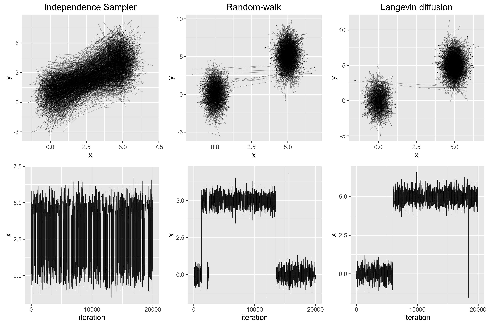

Throughout this example we are considering the following target distribution.

$$\pi(x, y) \propto \exp\left(\frac{1}{2}\left(4x^2 + \frac{1}{2}y^2 \right)\right) + 2\exp\left(\frac{1}{2}\left(4(x-5)^2 + \frac{1}{2}(y-5)^2 \right)\right)$$

```{r eval = FALSE}
#Density of interest (up to a proportion).
pi <- function(X) {
  x <- X[1]
  y <- X[2]
  exp(-0.5*(4*x^2 + 0.5*y^2)) + 2*exp(-0.5*(4*(x - 5)^2 + 0.5*(y - 5)^2))
}
```

The Metropolis-Hastings (MH) algorithm will be used to simulate dependent samples from this distribution. The MH algorithm is as follows:  
  
1. Start with any $x^{(0)}$ and a proposal distribution $T(x \rightarrow y)$.
2. Generate a $y$ from $T$ and compute the ratio $$r = \frac{\pi(y)T(y \rightarrow x^{(t)})}{\pi(x^{(t)})T(y \rightarrow x^{(t)} )}.$$
3. Acceptance/rejection decision $$x^{(t+1)} = \left\{ \begin{array}{ll} y & \text{with probability} \  \min(1, r)\\ x^{(t)} & \text{otherwise} \\ \end{array} \right. .$$  
  
```{r eval = FALSE} 
#############################
# M-H algorithm.
#############################
#q(x, y) is (proportional to) the density of the proposal distribution.
#rq(x) returns an observation from the proposal distribution.
MH_alg <- function(q, rq, m = 20000) {
  #MH ratio.
  ratio <- function(X, Y) {
    pi(Y)*q(Y, X)/(pi(X)*q(X, Y))
  }
  
  X <- matrix(0, nrow = m, ncol = 2)
  for(i in 1:(m - 1)) {
    #Generate an observation from the proposal distribution.
    Y <- rq(X[i, ])
    #Calculate the MH ratio and accept or reject.
    if(runif(1) < min(1, ratio(X[i, ], Y))) {
      X[i + 1, ] <- Y
    } else {
      X[i + 1, ] <- X[i, ]
    }
  }
  
  return(X)
}
```
The challenge here is finding a proposal distribution that works well. We will look at three different types of proposals.

### Independence sampler
Consider the independence sampler $T(x \rightarrow y) = q(y)$ with

$$q(y) \propto \exp\left( \frac{1}{2}(y - \mu)^T\Sigma^{-1}(y - \mu) \right),$$

where $\mu = (2.5, 2.5)^T$ and $\Sigma$ is the diagonal matrix with $\Sigma = \sigma^2 I_2$ . We can treat $\sigma$ as a parameter to the MH algorithm; varying $\sigma$ will affect the performance of the algorithm.

```{r eval = FALSE}
#############################
# Independence Sampler
#############################
#Proposal distribution T(X -> Y):
#We will use an independence sampler T(X, Y) = q(Y), with Y|X ~ N(mean, sigma)
mean <- c(2.5, 2.5)
sigma <- 4*diag(2)
#Density of the proposal (up to a proportion).
q <- function(X, Y) {
  exp(-0.5*(t(Y - mean) %*% solve(sigma^2) %*% (Y - mean)))
}
#Generator for the proposal distribution.
rq <- function(X) {
  mvrnorm(1, mean, sigma)
}

#Run the MH algorithm with this proposal.
samples1 <- MH_alg(q, rq)
```

### Random-walk proposal
Next, consider the random-walk proposal $T(x \rightarrow y) = q(y - x)$ with

$$q(y - x) \propto \exp\left( \frac{1}{2}(y - x)^T\Sigma^{-1}(y - x) \right),$$

where again $\Sigma = \sigma^2 I_2$. This method generates an observation from a normal distribution centered about $x$. In other words, we can only move to points that are local to the current location.

```{r eval = FALSE}
#############################
# Random-walk 
#############################
#Proposal distribution T(X -> Y):
#We will use an random-walk proposal T(X, Y) = q(Y) with Y|X ~ N(X, sigma)
sigma <- 2*diag(2)
#Density of the proposal (up to a proportion).
q <- function(X, Y) {
  Y <- Y 
  mean <- X
  exp(-0.5*(t(Y - mean) %*% solve(sigma^2) %*% (Y - mean)))
}
#Generator for the proposal distribution.
rq <- function(X) {
  mean <- X
  mvrnorm(1, mean, sigma)
}

#Run the MH algorithm with this proposal.
samples2 <- MH_alg(q, rq, m)
```
### Langevin diffusion process
This approach is similar to the random-walk, since we are again generating an observation that is local to $x$. Motivated by the Langevin diffusion process, we consider the proposal $T(x \rightarrow y) = q(y | x)$ with

$$q(y | x) = \propto \exp\left( \frac{1}{2}(y - \mu(x))^T\Sigma^{-1}(y - \mu(x)) \right),$$

where $\mu(x) = x + \frac{\sigma^2}{2}\nabla \log \pi(x)$, $\Sigma = \sigma^2 I_2$, and

$$\begin{aligned}
  \nabla \log \pi(x) &= \frac{\delta}{\delta x} \log \left( \exp\left(\frac{1}{2}\left(4x_1^2 + \frac{1}{2}x_2^2 \right)\right) + 2\exp\left(\frac{1}{2}\left(4(x_1-5)^2 + \frac{1}{2}(x_2-5)^2 \right)\right) \right) \\
  &= \frac{1}{\pi(x)} \left( \begin{matrix}
   -4x_1 \exp\left(\frac{1}{2}\left(4x_1^2 + \frac{1}{2}x_2^2 \right)\right) + 8(x_1 - 5)\exp\left(\frac{1}{2}\left(4(x_1-5)^2 + \frac{1}{2}(x_2-5)^2 \right)\right) \\
   -0.5x_2 \exp\left(\frac{1}{2}\left(4x_1^2 + \frac{1}{2}x_2^2 \right)\right) + (x_2 - 5)\exp\left(\frac{1}{2}\left(4(x_1-5)^2 + \frac{1}{2}(x_2-5)^2\right)\right) \end{matrix} \right).
  \end{aligned}$$

```{r eval = FALSE}
#############################
# Langevin Diffusion Process
#############################
#Proposal distribution T(X -> Y):
#The Langevin diffusion process: y = x + s^2/2 del(log(pi(x))) + s*epsilon.
sigma <- 1.4 #Step size.
#Gradient of log(f(x))
del_logpi <- function(X) {
  x <- X[1]
  y <- X[2]
  f = pi(X)
  del_x = (1/f)*(-4*x*exp(-0.5*(4*x^2 + 0.5*y^2)) - 
                    8*(x - 5)*exp(-0.5*(4*(x - 5)^2 + 0.5*(y - 5)^2)))
  del_y = (1/f)*(-0.5*y*exp(-0.5*(4*x^2 + 0.5*y^2)) - 
                    (y - 5)*exp(-0.5*(4*(x - 5)^2 + 0.5*(y - 5)^2)))
  return(c(del_x, del_y))
}
#Density of the proposal (up to a proportion).
q <- function(X, Y) {
  del <- del_logpi(X)
  mean <- X + sigma^2/2*del
  exp(-(t(Y - mean) %*% (Y - mean))/(2*sigma^2))
}
#Generator for the proposal distribution.
rq <- function(X) {
  del <- del_logpi(X)
  epsilon <- mvrnorm(1, c(0, 0), diag(2))
  return(X + sigma^2/2*del + sigma*epsilon)
}

#Run the MH algorithm with this proposal.
results3 <- MH_alg(q, rq, m)
```

### Results
Here are the results from one run of the simulation (with $m = 20000$). The independence sampler has no trouble going to and from each mode, whereas the other two methods tend to get stuck.  
  




```{r echo = FALSE, eval = FALSE}
library("ggplot2")
library("gridExtra")

#Plotting the results:
plot_xy <- function(X, title) {
  g <- ggplot(data.frame(x = X[, 1], y = X[, 2]), aes(x, y)) +
    geom_point(alpha = 0.05, size = 0.05) +
    geom_path(alpha = 0.4, size = 0.12) +
    labs(title = title, x = "x", y = "y") 
  return(g)
}
plot_x <- function(X) { 
  g <- ggplot(data.frame(x = 1:m, y = X[, 1]), aes(x, y)) +
    geom_path(alpha = 0.9, size = 0.15) +
    labs(x = "iteration", y = "x") +
    scale_x_continuous(breaks=c(0, m/2, m)) 
  return(g)
}

png("images/MH_binom_plot.png", 4000, 2666, res = 400)
plots <- list(plot_xy(X1, "Independence Sampler"), 
              plot_xy(X2, "Random-walk"), 
              plot_xy(X3, "Langevin diffusion"), 
              plot_x(X1), plot_x(X2), plot_x(X3))
grid.arrange(grobs = plots, layout_matrix = rbind(c(1:3), c(4:6)))
dev.off()
```
